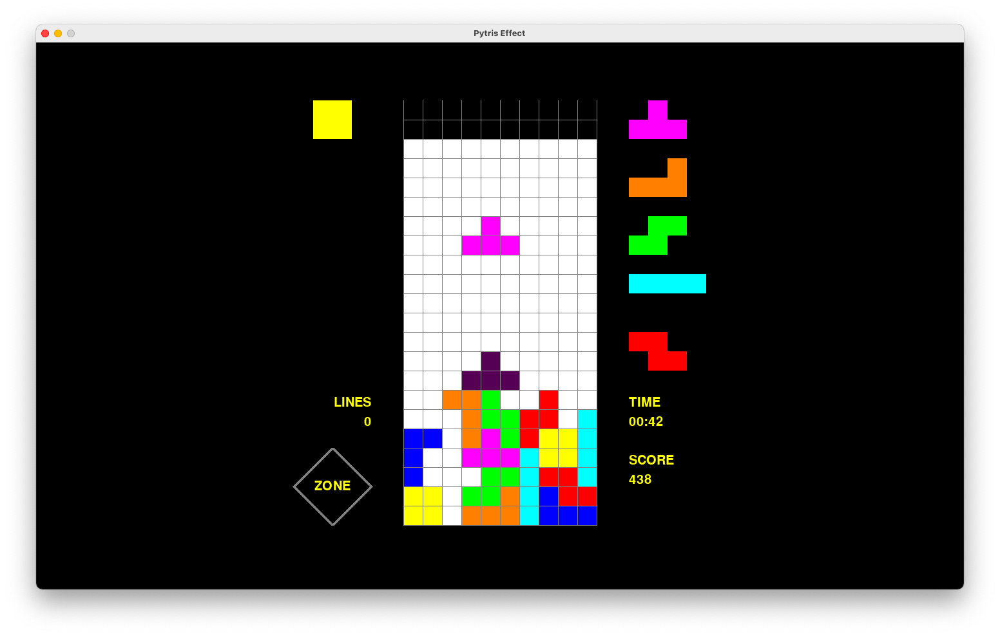
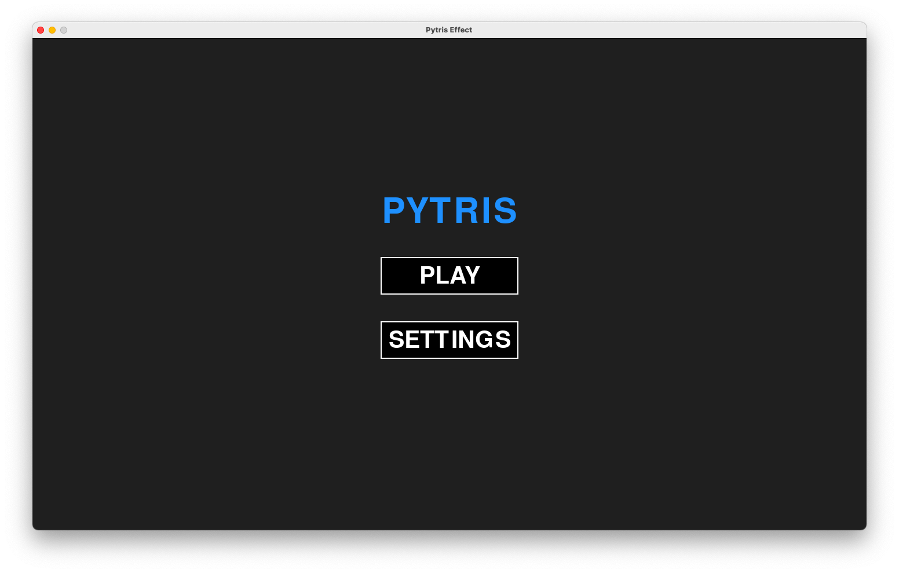
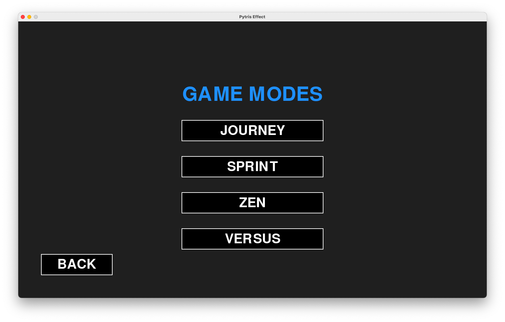
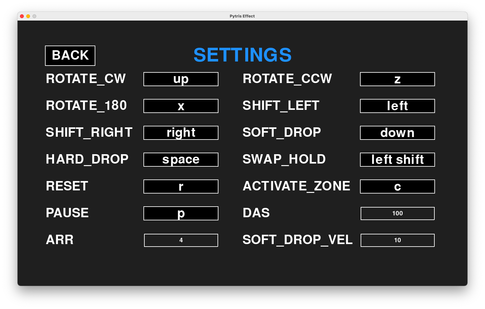

# Pytris Effect
Pytris Effect is a block stacking game inspired by Tetris® Effect and developed in Python using Pygame and numpy.

Screenshot:

Gameplay demo:

https://user-images.githubusercontent.com/42019089/129650803-47af6850-022c-48bf-8c37-5881fb5345e6.mov

Features:
- SRS rotation system with 180° spins
- Tetris® guideline scoring system and kick table
- Zone meter similar to that of Tetris® Effect
- Adjustable controls including DAS, ARR, and soft drop speed
- No line clear delay

Currently supported game modes:
- Journey: Try to stay alive and get the highest possible score throughout fifteen levels of increasing gravity by successfully clearing 150 lines without topping out. 
- Sprint: Try to clear 40 lines as fast as possible. 
- Zen: No objective, just stack to your heart's content. Topping out in this mode simply resets the matrix so you can continue stacking.

Details on the zone mechanic:
- Clear 40 lines to fill up the zone meter
- When zone is activated, the matrix glows blue and you have 20 seconds to clear as many lines as possible to increase your score dramatically!

Zone demo:

https://user-images.githubusercontent.com/42019089/129650947-991cfb9e-902a-43c2-a080-2f6c8723e455.mov

Notes:
- In Pytris Effect, the top out condition is determined by whether the spawning space of the next incoming tetromino is occupied 
- In contrast to guideline Tetris® games and other variants, while the matrix is 20 rows tall, each tetromino spawns in the 2 rows above the matrix 
- Current music and sound effects are borrowed from Tetris Online Japan and are subject to change in later developments

Other screenshots:
Title screen:

Game mode menu:

Settings screen with default controls:

